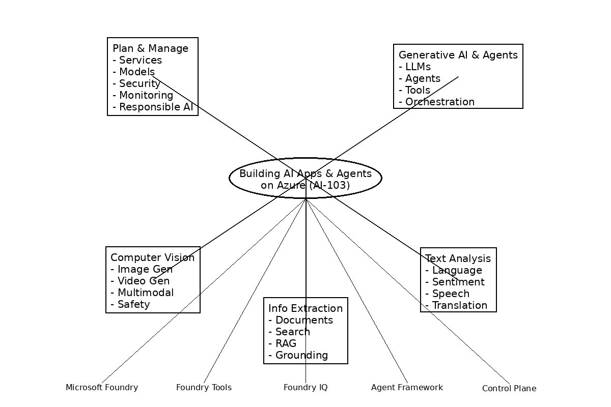

*← README.md*

# Appendix: Mind Map, Resources, and Exam Tips

---

## Mind Map: Building AI Apps and Agents on Azure

> [!NOTE]
> *This mind map is a conceptual visualization created for this guide. It is not part of official Microsoft documentation. Start from **Plan** (left), move to **Build** (center), then **Operate** (right). The platform components at the bottom are the building blocks you draw from at every stage.*

---

## Study Resources & Beta Exam Information

The official study guide recommends the following resources:

| **Resource** | **Description** |
| --- | --- |
| **Training** | Self-paced learning paths (30 modules, ~29 hr 36 min total) or instructor-led course **AI-103T00-A** (4-day, intermediate) |
| **Documentation** | Azure AI services, Azure AI Vision, Azure AI Video Indexer, Azure AI Language, Azure AI Speech, Azure AI Search, Azure OpenAI, Azure AI Document Intelligence |
| **Practice Assessment** | Free practice assessment available via the exam page |
| **Exam Sandbox** | Explore the exam environment before test day |
| **Accommodations** | Assistive devices, extra time, and other modifications available upon request |

### Beta Exam Discount

The **first 300 people** who take Exam AI-103 (beta) **on or before May 7, 2026** can get **80% off** using code **AI103Claxton**. Seats are offered on a **first-come, first-served basis**. This discount is **not available in Turkey, Pakistan, India, or China**.

**Scoring timeline:** You will not receive a score immediately after completing a beta exam because the scoring model is not yet finalized. Scores are released approximately **10 days after the exam becomes available worldwide (goes live)**. General availability of the certification is expected in **June 2026**. If you pass the beta, it counts toward your certification immediately once scores are released — you do **not** need to retake the live exam.

Additionally, candidates who register for **and take** the exam using the 80% discount code receive a **25% discount voucher** from the exam provider on their next exam, sent to the email used for registration once rescoring is complete. This voucher is only available to those who used the 80% discount code — paying full price does not qualify.

---

## Exam Preparation Tips

> [!NOTE]
> *The following recommendations are based on the exam structure and common certification best practices. They are not explicitly outlined in Microsoft's official documentation unless otherwise noted.*

1. **Work through all four learning paths** systematically — approximately **29 hours 36 minutes** across **30 modules** (LP1: ~6 hr 52 min, LP2: ~9 hr 52 min, LP3: ~5 hr 46 min, LP4: ~7 hr 06 min).

2. **Focus proportionally to exam weight.** Generative AI & Agents (30–35%) and Plan & Manage (25–30%) together compose over half the exam. Prioritize Chapters 1 and 2.

3. **Hands-on practice is essential.** Each learning path includes exercises (e.g., Exercise – Prepare for an AI development project).

4. **Know the Foundry evolution table.** Understanding which previous Azure AI concepts map to current Foundry concepts is likely to be tested.

5. **Understand all five orchestration patterns.** Be able to identify the correct pattern for a given scenario. The comparison table in Chapter 2 Section 2.4 is a high-value reference.

6. **Master the agent vs. workflow decision.** Know when to use an agent (open-ended, autonomous) vs. a workflow (defined steps, explicit control) vs. a simple function (deterministic task).

7. **Content Safety is cross-cutting.** Responsible AI topics appear across all domains — know Prompt Shields, Groundedness detection, and the content moderation APIs.

8. **Most questions cover GA features**, but the exam may contain questions on **Preview features if those features are commonly used**.

9. **Related topics may be covered.** The skill bullets in the study guide illustrate how each skill is assessed, but the exam may include related topics not explicitly listed.

---

## Final Exam Readiness Checklist

- ✅ Can you map each exam skill bullet to a Foundry component or Azure service?
- ✅ Can you identify the correct orchestration pattern for a scenario?
- ✅ Can you explain RAG end-to-end (ingest → index → retrieve → generate)?
- ✅ Do you understand the Foundry evolution from Azure AI Studio/Services?
- ✅ Can you configure Content Safety filters and agent approval workflows?
- ✅ Do you know when to use Foundry Tools vs. LLM-based approaches?
- ✅ Can you design a pipeline from raw documents to agent-ready knowledge?
- ✅ Do you understand fine-tuning eligibility, methods (SFT, DPO, RFT), and data requirements?
- ✅ Can you differentiate Handoff from Agent-as-Tools orchestration?

---

**← Previous:** Chapter5-InformationExtraction.md | **README.md**