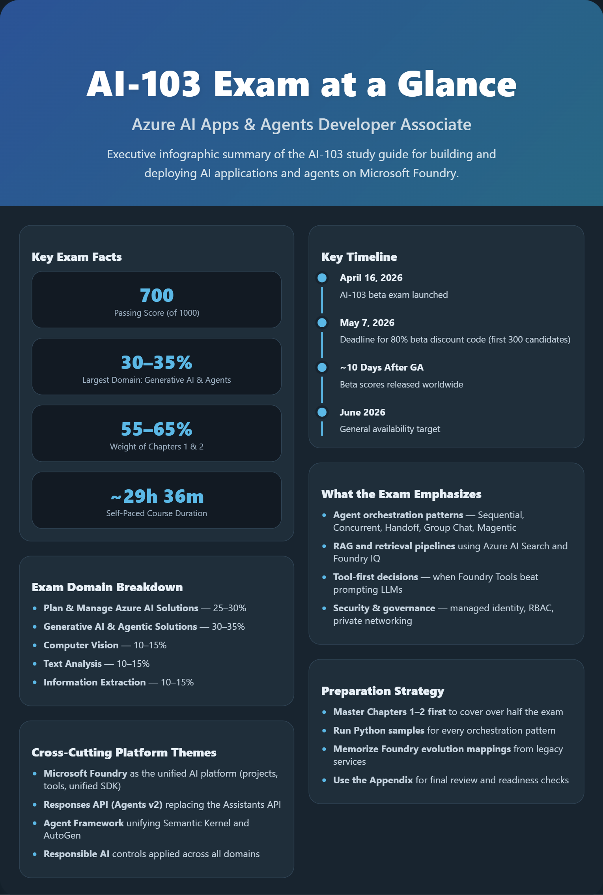

# AI-103 Study Guide  ## Microsoft Certified: Azure AI Apps and Agents

This repository is a structured, exam‑aligned study guide for **Exam AI‑103**. It is designed for **Azure AI developers** who build, manage, and deploy AI applications and agents on Azure using **Microsoft Foundry** and the **Microsoft Agent Framework**.

The content is organized by exam domain, includes practical guidance and examples, and emphasizes Responsible AI and real‑world design decisions expected on the exam.

---

## What This Repository Covers

The AI‑103 exam validates your ability to design, build, and operate AI solutions and agents on Azure. The exam is domain‑based, and this repository mirrors that structure.

### Chapters

- **Chapter 1 – Plan and Manage an Azure AI Solution (25–30%)**  
  Service and model selection, Foundry setup, CI/CD integration, monitoring, security, quotas, and Responsible AI controls.

- **Chapter 2 – Implement Generative AI and Agentic Solutions (30–35%)**  
  Generative AI applications, RAG, tool‑augmented flows, agent design, multi‑agent orchestration patterns, fine‑tuning, and operational optimization.

- **Chapter 3 – Implement Computer Vision Solutions (10–15%)**  
  Image and video generation, multimodal understanding, Content Understanding pipelines, and visual content safety.

- **Chapter 4 – Implement Text Analysis Solutions (10–15%)**  
  Language analysis, sentiment and PII detection, translation, speech‑to‑text, text‑to‑speech, and speech‑enabled agents.

- **Chapter 5 – Implement Information Extraction Solutions (10–15%)**  
  Document processing, OCR, Azure AI Search, enrichment pipelines, vector and hybrid search, and grounding with RAG.

- **Appendix – Resources and Exam Tips**  
  Mind map, study resources, exam preparation tips, and a final readiness checklist.

---

## How to Use This Repo

### Recommended Study Flow

1. **Start with Chapter 1 and Chapter 2**  
   These two domains together make up **more than half of the exam**. Master them first.

2. **Follow the build progression**
   - Plan and manage the solution
   - Build generative apps
   - Build and orchestrate agents
   - Add vision, language, and extraction capabilities

3. **Pay attention to cross‑cutting themes**
   - Microsoft Foundry architecture
   - Agent Framework orchestration patterns
   - Responsible AI and content safety
   - When to use agents vs workflows vs simple functions

4. **Use the Appendix for review**
   - Validate readiness using the checklist
   - Revisit the mind map for holistic understanding

---

## Repository Navigation

- [Chapter1-PlanManage.md](./AI-103-StudyGuide/Chapter1-PlanManage.md)
- [Chapter2-GenerativeAgents.md](./AI-103-StudyGuide/Chapter2-GenerativeAgents.md)
- [Chapter3-ComputerVision.md](./AI-103-StudyGuide/Chapter3-ComputerVision.md)
- [Chapter4-TextAnalysis.md](./AI-103-StudyGuide/Chapter4-TextAnalysis.md)
- [Chapter5-InformationExtraction.md](./AI-103-StudyGuide/Chapter5-InformationExtraction.md)
- [Appendix-Resources.md](./AI-103-StudyGuide/Appendix-Resources.md)

---

## Visual Overview

The repository includes a whiteboard‑style mind map that shows how all AI‑103 domains fit together:

- **ai-103-mindmap.png**

Use this image to quickly orient yourself before deep dives or final review.

---

## Responsible AI Focus

Responsible AI is not a single exam topic—it appears across all domains. This guide emphasizes:

- Content Safety and moderation
- Prompt protection and grounding
- Human‑in‑the‑loop controls
- Auditing, traceability, and governance
- Secure agent behavior and tool access

Expect Responsible AI considerations in design, implementation, and scenario‑based exam questions.

---

## Exam Preparation Tips

- Prioritize **scenario‑based reasoning**, not memorization.
- Understand **why** a service or pattern is chosen, not just **how** it works.
- Be able to recognize the correct **agent orchestration pattern** for a scenario.
- Know when **not** to use an agent.
- Expect questions that combine **security, cost, safety, and performance** constraints.

---

## Disclaimer

This repository is an **original study guide** based on public Microsoft documentation and learning paths.  
It is **not official exam material** and does not reproduce Microsoft Learn content verbatim.

---

Happy studying, and good luck on **AI‑103** 🚀

